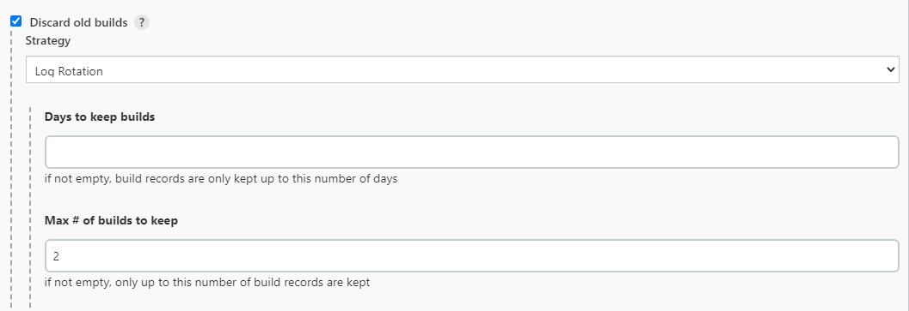
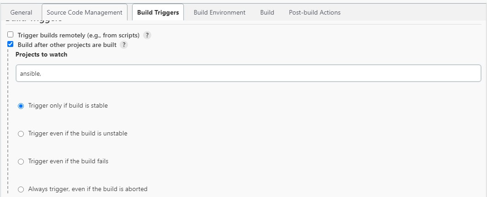
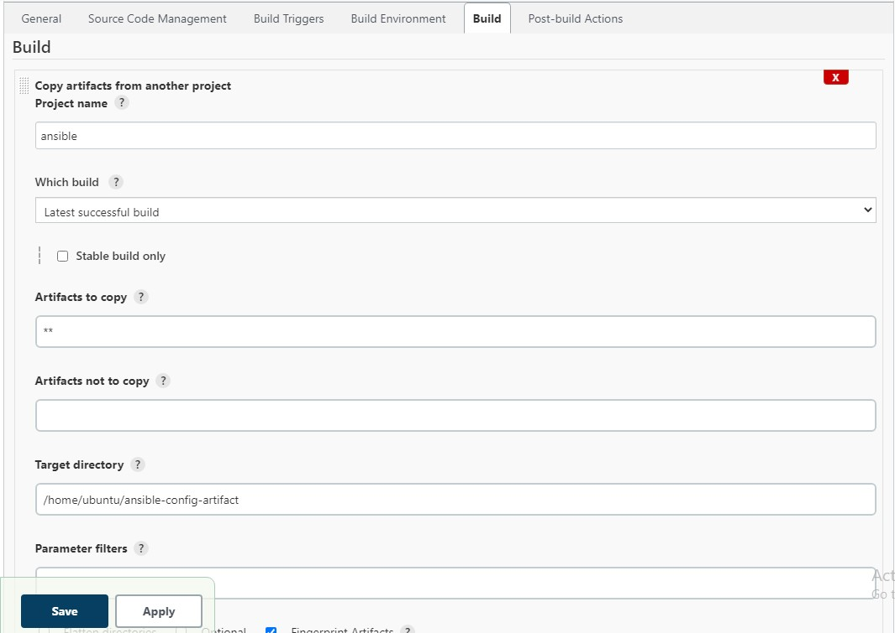
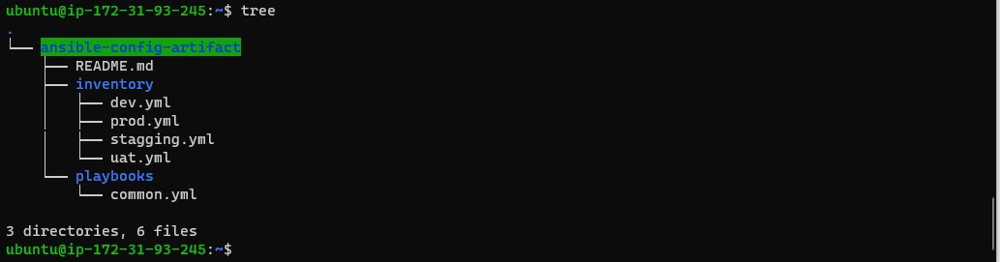
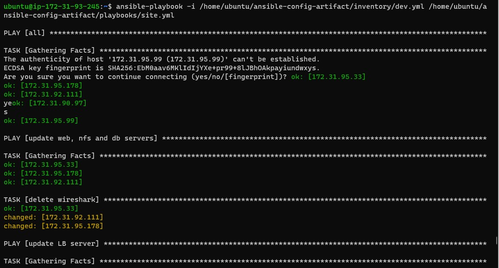

# **ANSIBLE REFACTORING AND STATIC ASSIGNMENTS (IMPORTS AND ROLES)** #

This project concentrates on improving ansible codes through **REFACTORING** It also explore using  imports functionality in Ansible. 
Imports allow to effectively re-use previously created playbooks in a new playbook – it allows you to organize your tasks and reuse them when needed.

###  **Step 1**  – Jenkins job enhancement ###

Every new change in the codes creates a separate directory which is not very convenient when we want to run some commands from one place. Besides, 
it consumes space on Jenkins serves with each subsequent change. Let us enhance it by introducing a new Jenkins project/job – we will require Copy Artifact plugin.

1. Go to your Jenkins-Ansible server and create a new directory called ansible-config-artifact – we will store there all artifacts after each build.
~~~
sudo mkdir /home/ubuntu/ansible-config-artifact
~~~
2. Change permissions to this directory, so Jenkins could save files there 
~~~
chmod -R 0777 /home/ubuntu/ansible-config-artifact
~~~
3. Install copy artifacts plugin in Jenkins server

4. Create a new Freestyle project and name it save_artifacts.

This project will be triggered by completion of your existing ansible project. Configure it accordingly:

6. The main idea of *save_artifacts* project is to save artifacts into **/home/ubuntu/ansible-config-artifact** directory. To achieve this, create a Build step and choose *Copy artifacts from other project*, specify *ansible* as a source project and **/home/ubuntu/ansible-config-artifact** as a target directory.

7. Test by making some change in README.MD file inside the ansible-config-mgt repository (right inside master branch).
If both Jenkins jobs have completed one after another – you shall see your files inside /home/ubuntu/ansible-config-artifact directory and it will be updated with every commit to your master branch.

Now your Jenkins pipeline is more neat and clean.

## **REFACTOR ANSIBLE CODE BY IMPORTING OTHER PLAYBOOKS INTO SITE.YML** ##

**Step 2** – Refactor Ansible code by importing other playbooks into site.yml

It is pretty simple set of instructions for only 2 types of OS, but imagine you have many more tasks and you need to apply this playbook to other servers with different requirements. In this case, you will have to read through the whole playbook to check if all tasks written there are applicable and is there anything that you need to add for certain server/OS families. Very fast it will become a tedious exercise and your playbook will become messy with many commented parts. Your DevOps colleagues will not appreciate such organization of your codes and it will be difficult for them to use your playbook.

Breaking tasks up into different files is an excellent way to organize complex sets of tasks and reuse them.

Let see code re-use in action by importing other playbooks.

1. Within *playbooks* folder, create a new file and name it site.yml – This file will now be considered as an entry point into the entire infrastructure configuration. Other playbooks will be included here as a reference. In other words, site.yml will become a parent to all other playbooks that will be developed. Including common.yml that you created previously.

2. Create a new folder in root of the repository and name it static-assignments. The static-assignments folder is where all other children playbooks will be stored. This is merely for easy organization of your work. It is not an Ansible specific concept, therefore you can choose how you want to organize your work. You will see why the folder name has a prefix of static very soon. For now, just follow along.

3. Move common.yml file into the newly created static-assignments folder.

4. Inside site.yml file, import common.yml playbook.
5. Run ansible-playbook command against the dev environment
Since you need to apply some tasks to your dev servers and wireshark is already installed – you can go ahead and create another playbook under static-assignments and name it common-del.yml. In this playbook, configure deletion of wireshark utility.
~~~
---
- name: update web, nfs and db servers
  hosts: webservers, nfs, db
  remote_user: ec2-user
  become: yes
  become_user: root
  tasks:
  - name: delete wireshark
    yum:
      name: wireshark
      state: removed

- name: update LB server
  hosts: lb
  remote_user: ubuntu
  become: yes
  become_user: root
  tasks:
  - name: delete wireshark
    apt:
      name: wireshark-qt
      state: absent
      autoremove: yes
      purge: yes
      autoclean: yes
 ~~~
 
 Run:
 ~~~
 ansible-playbook -i /home/ubuntu/ansible-config-artifact/inventory/dev.yml /home/ubuntu/ansible-config-artifact/playbooks/site.yml
 ~~~
 
 
 
 Make sure that wireshark is deleted on all the servers by running wireshark --version
 
 ## **CONFIGURE UAT WEBSERVERS WITH A ROLE ‘WEBSERVER’** ##
 
 ### **Step 3** – Configure UAT Webservers with a role ‘Webserver’ ###

